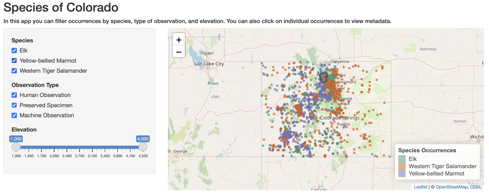

Shiny Demo
================
Caitlin Mothes
2025-11-30

## Shiny Demo

[Shiny](https://shiny.rstudio.com/) is an R package that takes
interactivity to another level through interactive web applications,
allowing users to interact with any aspect of your data and analysis.
You can host them as standalone web apps or embed them within R Markdown
documents or build dashboards. And the best part is…**you can do it all
within R, no web development skills required!**

So, lets walk through the steps and build a quick shiny app! For this
demo we are going to build off some of the data and interactive maps we
made in the [Geospatial
lessons](https://github.com/Env-Data-Sci-FA25/Geospatial). For example,
we have a lot of species occurrence data with numerous variables. Based
on various attributes, we could allow users to choose what they want to
see on the map, such as which species, what type of observation they
were, and the range of elevation species were found at.

### Prerequisites

Before we start, make sure you have:

- Basic familiarity with R and RMarkdown
- Required packages installed: `shiny`, `leaflet`, `sf`, `dplyr`
- Data file: `shinyDemoData.RData` (available in the Final-Projects
  repository)

### Understanding Shiny’s Structure

*A little background on how Shiny works.*

Shiny apps are contained in a single script called `app.R`. `app.R` has
three components:

- a **user interface (ui)** object, which controls the layout and
  appearance of your app

- a **server function**, which contains the instructions needed to build
  your app

- a call to **`shinyApp()`** which creates your web application based on
  your ui/server objects.

Here’s how these pieces work together:

    User interacts with widgets (ui) 
        ↓
    Input values sent to server
        ↓
    Server processes data (reactive)
        ↓
    Output rendered back to ui

**Important Working Directory Note:** Shiny apps are self-contained. The
`app.R` file assumes its folder is the working directory, NOT your
project root directory. This means all file paths should be relative to
the folder containing `app.R`.

## Create your first shiny app

Let’s create a new shiny app by going to **File -\> New File -\> Shiny
Web App**. Call it something like ‘shinyDemo’, and save it in the
project directory you are working in (which should be the default). Keep
all other default settings.

This creates a new folder in your project directory with the same name
you just gave the application, and within that folder is the `app.R`
script which automatically gives an outline of our shiny app, with the
`ui` and `server` objects and a call to `shinyApp()` at the end.

RStudio actually gives you a template app to work with by filling in the
`ui` and `server` elements with some demo widgets and data. We can
actually run this script and make our first shiny app!

To run this app, from the `app.R` script click the ‘Run App’ button in
the upper right with the green arrow.


This is a very basic shiny app, but inspect the `app.R` script code and
compare it to the application it creates. In the `ui` we create the
layout (a sidebar panel and a main panel), specify the widgets and its
settings (`sliderInput()`) and a placeholder for an output
(`plotOutput()`). One of the most important things to notice is that
each widget or output in the `ui` must be given an ID, which is the
first argument in each function (e.g., the ID for `sliderInput()` is
“bins”, the ID for the `plotOutput()` is “distPlot”).

These IDs are how you define what happens on the server side. When we
look at this server code, we create the plot output by calling
`output${insert ID name here}` and assign it some code to create the
plot. Within this code chunk, we also see `input$bins`. This will return
the value that the user has selected from the slider input and create
the plot (in this case, changing the bin size of the plot).

## Create a shiny app for Colorado species occurrence data

### Getting Started

Remember that the `app.R` runs assuming that the directory it is in is
the working directory. To get the data for this demo shiny app, **find
`shinyDemoData.RData` in the Final-Projects repo and copy it to the new
shiny app folder you just created (so the same folder `app.R` is in).**

Now lets set up our app script by loading necessary libraries and data
sets. Put this chunk of code at the top of `app.R`

``` r
#set up for the shiny app
library(shiny)
library(leaflet)
library(sf)
library(dplyr)

# read in data
load("shinyDemoData.RData") # includes `occ` and `ROMO`
```

**Note: the use of our `setup.R` script and `source("setup.R")` will NOT
work in shiny apps. You must load each package in with `library()`
instead as above.**

### Troubleshooting Tips

If your app won’t run, check:

1.  Is `shinyDemoData.RData` in the same folder as `app.R`?
2.  Are all required packages installed?
3.  Did you save `app.R` after making changes?

`occ` is an sf point object, and for each species occurrence point we
have attributes for the species, year and month of observation, type of
observation, and the elevation at that occurrence. We also loaded in the
park boundary polygon for Rocky Mountain National Park (`ROMO`) that we
will add to the map as well. Let’s use `leaflet` to make an interactive
map of all these layers.

### Define the `ui`

Lets keep the same layout as the template `app.R` script, with a fluid
page with a title panel, followed by a sidebar layout with a main panel
(our map) and a side panel (user inputs). You can learn more about
different layout options
[here](https://shiny.rstudio.com/articles/layout-guide.html).

However, we do want to change the widgets and output. **Delete the
current `ui` and replace it with the following code (reading the
comments to see what each widget is doing):**

``` r
ui <- fluidPage(
  #App title
  titlePanel("Species of Colorado"),
  
  # Add some informational text using and HTML tag (i.e., a level 5 heading)
  h5(
    "In this app you can filter occurrences by species, type of observation, and elevation. You can also click on individual occurrences to view metadata."
  ),
  
  # Sidebar layout
  sidebarLayout(
    # Sidebar panel for widgets that users can interact with
    sidebarPanel(
      # Input: select species shown on map
      checkboxGroupInput(
        inputId = "species",
        label = "Species",
        # these names should match that in the dataset, if they didn't you would use 'choiceNames' and 'choiceValues' like we do for the next widget
        choices = list("Elk", "Yellow-bellied Marmot", "Western Tiger Salamander"),
        # selected = sets which are selected by default
        selected = c("Elk", "Yellow-bellied Marmot", "Western Tiger Salamander")
      ),
      
      # Input: Filter points by observation type
      checkboxGroupInput(
        inputId = "obs",
        label = "Observation Type",
         choiceNames = list(
          "Human Observation",
          "Preserved Specimen",
          "Machine Observation"
        ),
        choiceValues = list(
          "HUMAN_OBSERVATION",
          "PRESERVED_SPECIMEN",
          "MACHINE_OBSERVATION"
        ),
        selected = c("HUMAN_OBSERVATION",
                     "PRESERVED_SPECIMEN",
                     "MACHINE_OBSERVATION"
        )
      ),
      
      
      # Input: Filter by elevation
      sliderInput(
        inputId = "elevation",
        label = "Elevation",
        min = 1000,
        max = 4500,
        value = c(1000, 4500)
      )
      
    ),
    
    # Main panel for displaying output (our map)
    mainPanel(# Output: interactive tmap object
      leafletOutput("map"))
    
  )
  
)
```

### Define the `server`

Now we need to define the server logic (i.e., what R code to run when a
user interacts with the application) that draws a map based on the user
inputs.

#### Understanding Reactivity

The difference from your usual way of coding is that now our `occ` data
set will be filtered based on the user inputs in the `ui`. When an
environmental object **changes based on user inputs**, we call this a
***reactive*** object and define it within the `reactive()` function.

Here’s the key difference:

- **Normal R:** `my_data <- filter(occ, Species == "Elk")` runs once
- **Reactive R:**
  `my_data <- reactive(filter(occ, Species == input$species))` re-runs
  whenever `input$species` changes
- **Important:** When using reactive objects, always add `()`: use
  `my_data()` not `my_data`

Finally, to create the map we put the code within `renderLeaflet()`.
Here is the final server code, which you should replace with the
template `server <-` code in `app.R`. *Note: be cautious of proper
bracket placement in this code, rainbow parentheses come in handy with
Shiny apps!*

``` r
server <- function(input, output) {
  # Make a reactive object for the occ data by calling inputIDs to extract the values the user chose
  occ_react <- reactive(
    occ %>%
      filter(Species %in% input$species) %>%
      filter(basisOfRecord %in% input$obs) %>%
      filter(elevation >= input$elevation[1] &
               elevation <= input$elevation[2])
  )
  
  # Render the map based on our reactive occurrence dataset
  
  # Create color palette for species
  pal <- colorFactor(palette = "Dark2", domain = occ$Species)
  output$map <- renderLeaflet({
    # Create leaflet map
    leaflet() %>%
      addTiles() %>%
      # Add species occurrence points
      addCircleMarkers(
        data = occ_react(),  # Note the () after occ_react!
        radius = 3,
        color = ~ pal(Species),
        fillOpacity = 0.7,
        stroke = FALSE,
        popup = ~ paste0(
          "<b>Species:</b> ",
          Species,
          "<br>",
          "<b>Record Type:</b> ",
          basisOfRecord,
          "<br>",
          "<b>Elevation (m):</b> ",
          elevation
        )
      ) %>%
      # Add ROMO polygon
      addPolygons(
        data = ROMO,
        fillOpacity = 0.7,
        weight = 2,
        color = "black",
        fillColor = "gray"
      ) %>%
      # Add legend
      addLegend(
        position = "bottomright",
        pal = pal,
        values = occ$Species,
        title = "Species Occurrences"
      )
    
  })
  
}
```

Now, you can click “Run App” in your `app.R` script to view our new
shiny app. Remember always have this line of code at the end of your
`app.R` script:

``` r
# Run the application 
shinyApp(ui = ui, server = server)
```



### Common Errors

As you build Shiny apps, you may encounter these common issues:

- **“Object not found”**: Check that reactive objects use `()` when
  called (e.g., `occ_react()` not `occ_react`)
- **“Unexpected symbol”**: Check for missing commas between ui elements
- **Data not loading**: Verify file path is relative to `app.R`
  location, not project root
- **App won’t update**: Make sure you saved `app.R` before clicking “Run
  App”

### Sharing your application

To share Shiny applications you can either share the shiny app folder
you created (which has the bundled `app.R` file and any associated data
files) and the user can run it in their own R session, or you can
publicly host your application for free through accounts like
[shinyapps.io](https://www.shinyapps.io/).

Follow [this
tutorial](https://shiny.rstudio.com/articles/shinyapps.html) for
creating a free shinyapps.io account and deploying your shiny
application.

### Further exploration

This was a very basic example of a shiny application. There are a huge
range of layouts, widgets, and outputs to explore in Shiny. Some places
to get started are the Shiny [cheat
sheet](https://shiny.rstudio.com/images/shiny-cheatsheet.pdf) and the
Shiny [gallery](https://shiny.rstudio.com/gallery/) (which includes
links to the raw code that built the application).
